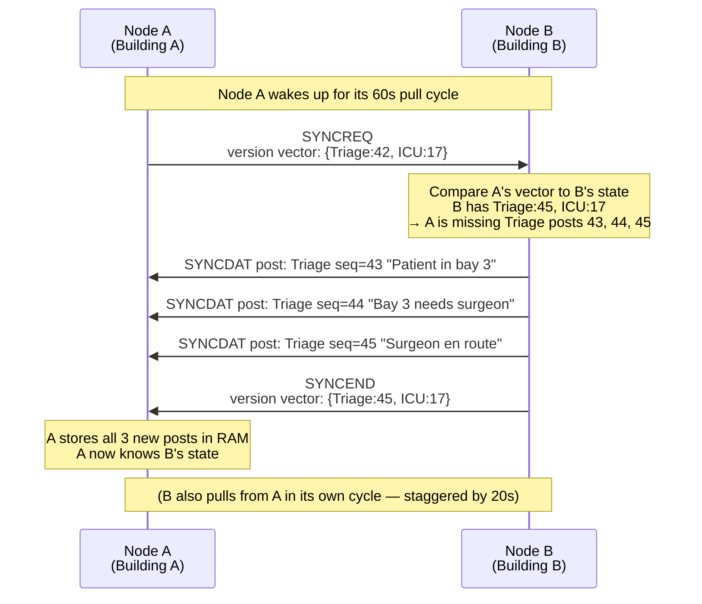
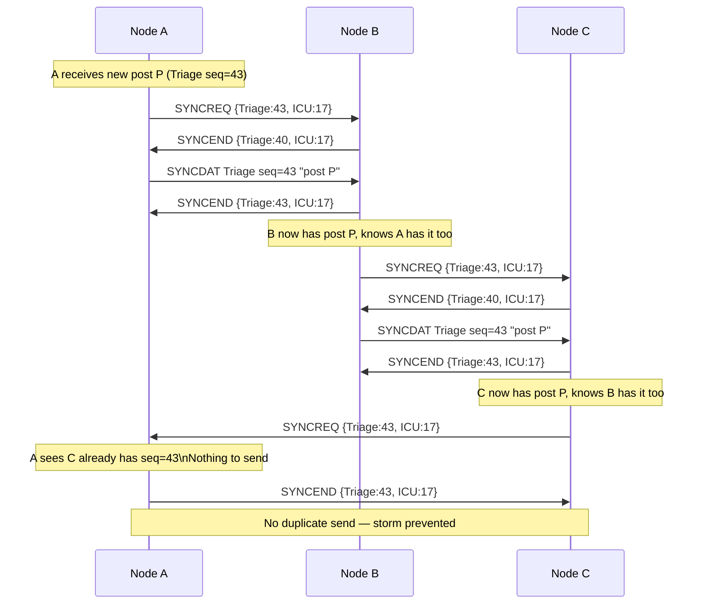

# Replication Protocol

This document describes how multiple SIREN room-server nodes keep their message histories synchronised. It is aimed at developers and network engineers who need to understand or implement the sync mechanism.

---

## Beginner's Introduction: Why Replication?

Imagine a hospital with two buildings 500 metres apart. Each building has its own SIREN room server (Heltec device). A nurse in Building A posts a message to the "Triage" room. Without replication, only the room server in Building A stores and distributes that message. Users connected to Building B's server would never see it.

**Replication** is the process by which the two room servers exchange messages they have received, so that both eventually have the same complete history — like two postal sorting offices swapping their undelivered mail until both have processed everything.

This is called **anti-entropy replication** in distributed systems: the "entropy" is the difference between two copies of the same dataset, and the protocol works to eliminate (anti) that difference.

---

## Status of Replication in SIREN

> **Phase 5 (JES-723) and Phase 6 (JES-724) are not yet fully implemented.** The data structures and peer configuration are in place (Phase 1 groundwork), but the SYNCREQ/SYNCDAT/SYNCEND wire protocol is not yet active.
>
> This document describes the **planned design**, based on the architecture decisions recorded in JES-723 and JES-724. Implementors should verify against the actual firmware code once Phase 5 is complete.

---

## Concept: Version Vectors

Before describing the protocol, it helps to understand how SIREN tracks "what has each node seen?"

Each post has a unique identity: a `(room_slot_hash, sequence_number)` pair. The `room_slot_hash` is the first few bytes of the room's public key (enough to identify the room across nodes). The `sequence_number` is a monotonically increasing counter per room.

A **version vector** is a compact data structure that says: "For each room I know about, the highest sequence number I have seen." For example:

```
{
  "A1B2C3D4": 42,   // room with hash A1B2... has 42 posts
  "E5F6A7B8": 17    // room with hash E5F6... has 17 posts
}
```

When two nodes compare version vectors, they can determine exactly which posts each is missing from the other — without listing every individual post.

---

## Visual Overview

Before the detailed protocol, here is a one-picture summary of how two SIREN nodes sync:



---

## Protocol: SYNCREQ / SYNCDAT / SYNCEND

Replication uses three custom packet types transmitted over the LoRa mesh as encrypted direct messages between room server nodes:

### SYNCREQ — Sync Request

Sent by Node A to Node B (a configured peer). Contains:
- Node A's version vector for all rooms it knows about

This says: "Here is what I have — please send me anything newer."

### SYNCDAT — Sync Data

Sent by Node B in response to each SYNCREQ. Contains:
- One or more posts that Node A is missing (based on the version vector comparison)
- Each post includes: room identifier, sequence number, author identity, timestamp, and message text

SYNCDAT packets are sent one per post (or batched if payload permits). Node B sends them in timestamp order (oldest first).

### SYNCEND — Sync End

Sent by Node B after all missing posts have been sent. Contains:
- Node B's own version vector

This allows Node A to update its knowledge of what Node B has, and to reciprocate by sending posts that Node B is missing.

---

## Why Encrypted DMs?

SIREN sync frames travel as **encrypted Direct Messages** (DMs) between room server nodes — not as radio broadcasts. This matters for several reasons:

- **Privacy**: sync traffic is not readable by other devices in range — only the addressed peer node can decrypt it
- **Addressing**: each DM is addressed to the peer's Ed25519 public key, ensuring it reaches the right node
- **Security**: X25519 key exchange provides end-to-end encryption; replay attacks are blocked by MeshCore's packet dedup
- **Reliability**: DM retransmission (up to 3 retries) handles occasional radio packet loss

The peer's public key must be stored in the local peer list (`peer add <hex_pubkey> <name>`) for this to work.

---

## Anti-Entropy Pull Model

SIREN uses a **pull model**: each node periodically asks its peers for what it is missing. This avoids the need for real-time acknowledgements during the sync itself.

### Pull schedule

With N nodes in the cluster (Phase 6: 3-node triangle), each node staggers its pull requests to avoid simultaneous transmissions:

| Node | Pull timing |
|---|---|
| Node 1 | T+0s, then every 60s |
| Node 2 | T+20s, then every 60s |
| Node 3 | T+40s, then every 60s |

The 20-second stagger prevents all nodes from transmitting SYNCREQ at the same instant, which would cause collisions on the LoRa channel.

### Deduplication

If a post arrives via replication that already exists in the local store (identified by `(room_slot_hash, sequence_number)`), it is silently discarded. This prevents replication storms (infinite loops of re-syncing the same data).

---

### Pull timing diagram (3-node cluster)

```
Time →  0s          20s         40s         60s         80s         100s
        │           │           │           │           │           │
Node A  [→B SYNC]   ·           ·           [→B SYNC]   ·           ·
Node B  ·           [→C SYNC]   ·           ·           [→C SYNC]   ·
Node C  ·           ·           [→A SYNC]   ·           ·           [→A SYNC]
```

Each node pulls from exactly one peer per 60-second cycle. The 20-second stagger avoids simultaneous LoRa transmissions.

---

## Storm Prevention via Version Vectors

In a three-node triangle (A ↔ B ↔ C), a naive replication protocol could loop:
1. A has post P
2. A → B: sends P
3. B → C: sends P
4. C → A: sends P back to A

Version vectors prevent this. When A sends P to B, A's version vector includes the sequence number for P. B updates its vector to record that A already has P. When C later pulls from B, C sends its vector; B compares and does not include P in what it sends C if C's vector shows it already has P.



---

## Peer Configuration

Peers are configured via the CLI or persisted in SPIFFS:

```
> peer add <hex64_pubkey> <name>
> peer list
> peer del <idx>
```

Up to **8 peers** (`MAX_PEERS = 8`) can be configured per node. Each peer entry stores:
- The peer's Ed25519 public key (32 bytes)
- A human-readable name
- The last-contact timestamp

Peer configuration is stored in `/peer_cfg` on SPIFFS and survives reboots.

---

## Wire Format (Planned)

SYNCREQ, SYNCDAT, and SYNCEND are sent as encrypted direct messages over MeshCore, using the same DM encryption path as user messages. This means:

- Both nodes must have each other's public key in their peer list
- The channel is encrypted end-to-end (no cleartext on the LoRa channel)
- Replay protection is inherited from MeshCore's packet de-dup mechanism

Packet type codes are distinct from user message codes to avoid misinterpretation.

---

## Phase 5 vs. Phase 6

| Phase | Description |
|---|---|
| Phase 5 (JES-723) | Two-node sync: Node A ↔ Node B. Proves the SYNCREQ/SYNCDAT/SYNCEND protocol works end-to-end. |
| Phase 6 (JES-724) | Three-node triangle: A ↔ B ↔ C. Proves deduplication and storm prevention work with a cycle in the topology. |

Phase 5 must be completed and hardware-proven before Phase 6 begins.

---

## Limitations

- Posts are stored in RAM only. Replication copies posts to peer nodes' RAM. A simultaneous power loss of all nodes loses all undelivered messages.
- The replication protocol does not guarantee total ordering across nodes — posts are ordered by timestamp (RTC clock), and clock drift between nodes can cause minor ordering inconsistencies.
- With 1% LoRa duty cycle shared across user traffic and replication traffic, heavy message loads will slow down replication.
- Maximum 8 peers per node. For larger clusters, a hierarchical topology (some nodes serving as replication hubs) would be needed.

---

## MQTT as a Second Replication Transport (JES-792)

MQTT provides a parallel, infrastructure-backed transport alongside the LoRa mesh anti-entropy:

| Property | LoRa Mesh | MQTT |
|---|---|---|
| Range | RF-limited, mesh-extended | IP network (WiFi STA required) |
| Encryption | ECDH per-sender-receiver | AES-256-CTR per-room key |
| Duty cycle | 1% shared | No RF cost |
| Availability | Mesh-resilient, no infrastructure | Requires broker + WiFi |

**Phase (a)** (publish-only, JES-792) is independent of JES-723/724.
**Phases (b) and (c)** build on the same version-vector model as LoRa anti-entropy — a single reconciliation function handles both transports.

See `docs/mqtt.md` for the full MQTT specification and encryption details.

---

## Related Issues

- **JES-723**: Phase 5 — anti-entropy replication, two nodes
- **JES-724**: Phase 6 — three-node triangle test
- **JES-732**: Dest-hash collision fix (prerequisite for correct multi-room replication)
- **JES-792**: MQTT transport + dual-path sync
