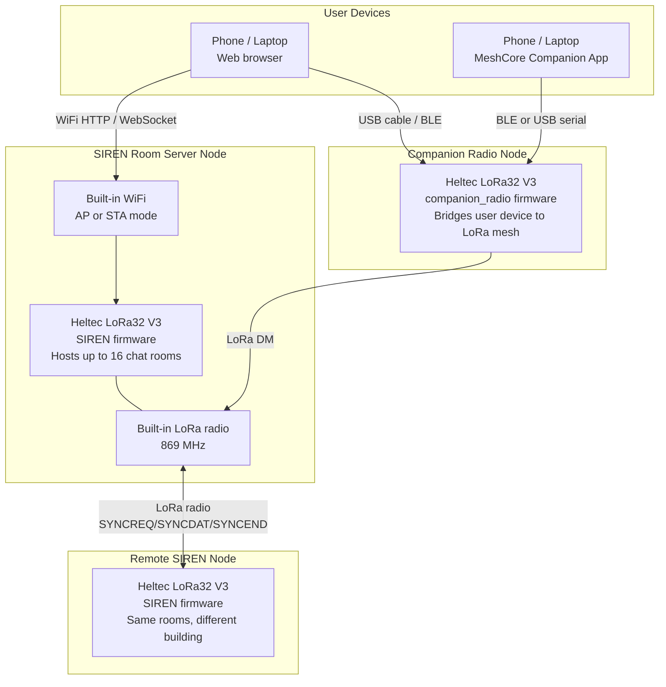
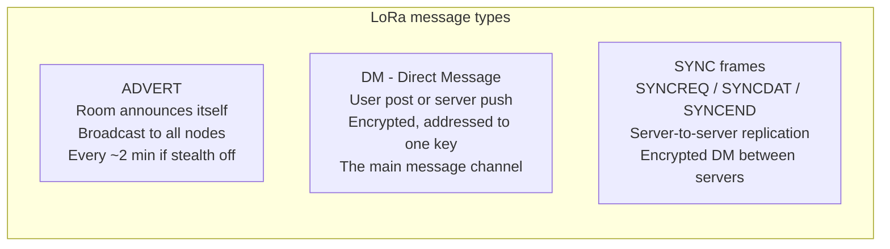
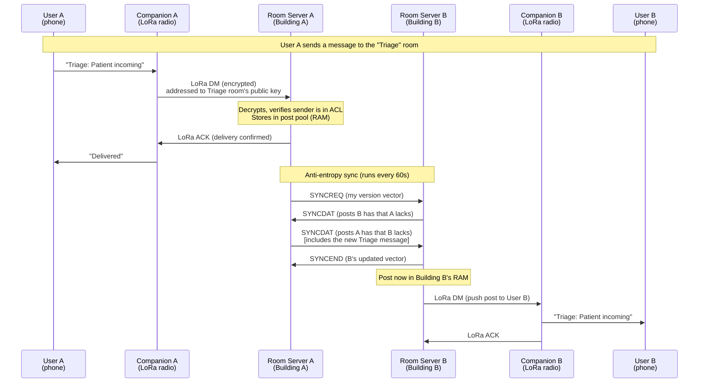
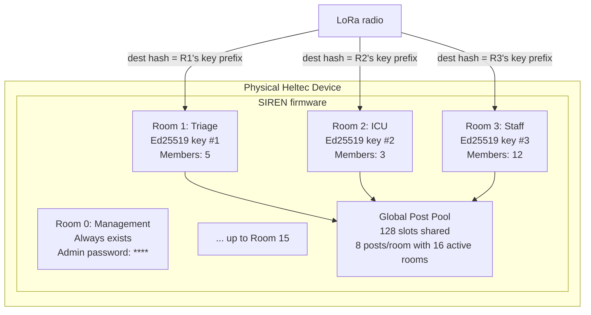
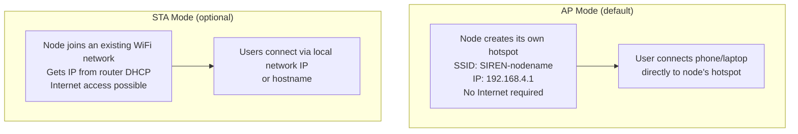
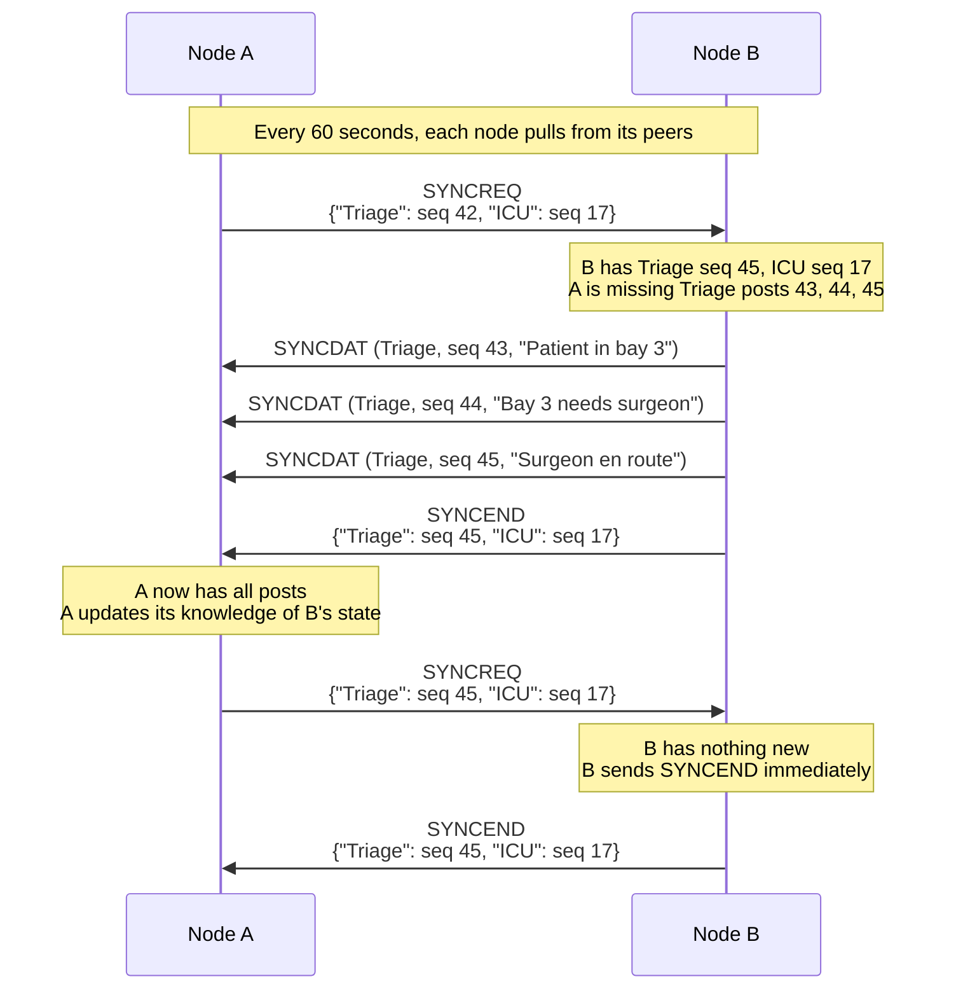
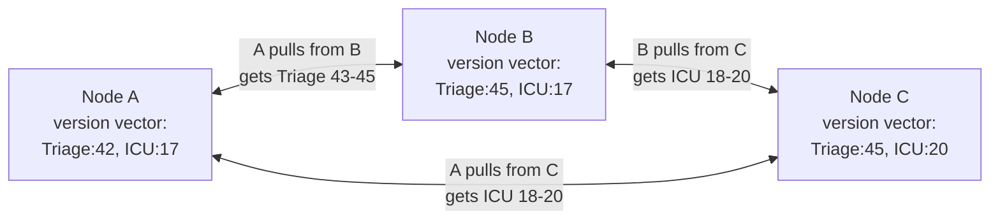
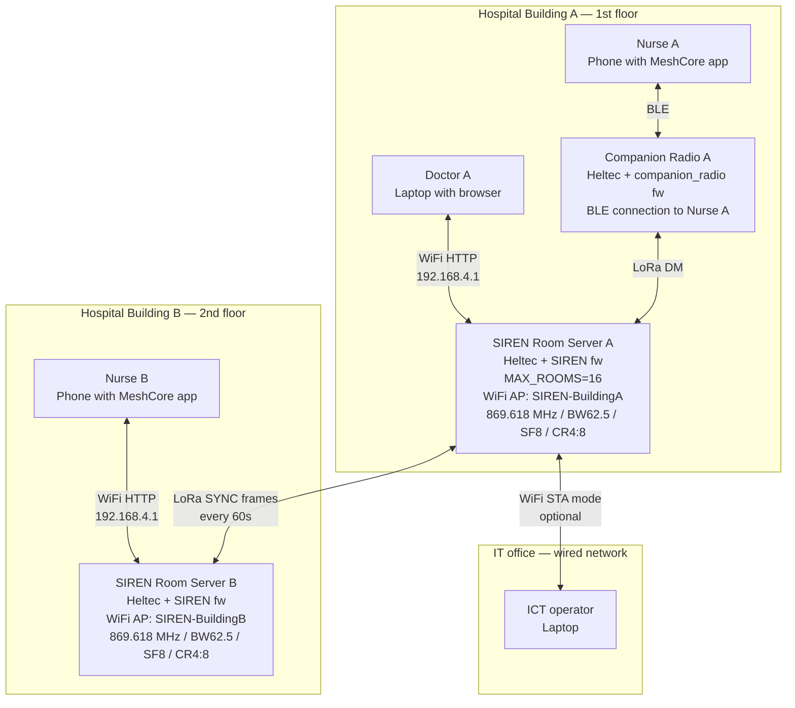

# SIREN System Overview

This document gives a **schematic, visual overview** of the complete SIREN system. It shows how all the hardware nodes, software components, and communication channels fit together. It is written for someone who is new to SIREN and wants to understand "the big picture" before diving into the details.

---

## The Complete System at a Glance

The diagram below shows every component of a typical SIREN deployment and how they are connected.

```
                         SIREN NETWORK TOPOLOGY
                         ======================

  ┌──────────────────────────────────────────────────────────────────────┐
  │  Building A                                                          │
  │                                                                      │
  │  ┌─────────────┐     WiFi AP      ┌───────────────────────────────┐ │
  │  │  Laptop /   │◄────────────────►│  SIREN Room Server Node A     │ │
  │  │  Phone      │  http://192..    │  (Heltec LoRa32 V3)           │ │
  │  │  (Web UI)   │                  │                               │ │
  │  └─────────────┘                  │  Rooms: Triage, Staff, ICU    │ │
  │                                   │  WiFi: AP mode (hotspot)      │ │
  │  ┌─────────────┐     BLE/USB      │  LoRa: 869.618 MHz            │ │
  │  │  Laptop /   │◄────────────────►│  Antenna ─────────────────┐  │ │
  │  │  Phone      │  Web Serial/BLE  └───────────────────────────│──┘ │
  │  │  (SIREN app)│                                              │     │
  │  └─────────────┘                               LoRa radio    │     │
  └──────────────────────────────────────────────────────────────│──────┘
                                                                 │
                                          ┌──────────────────────▼──────┐
                                          │   ~~~~~ LoRa 869 MHz ~~~~~   │
                                          │   (radio waves, no cables)   │
                                          │   range: 1–5 km open field   │
                                          └──────────────────────┬──────┘
                                                                 │
  ┌──────────────────────────────────────────────────────────────│──────┐
  │  Building B                                                  │      │
  │                                       LoRa radio            │      │
  │  ┌─────────────┐     WiFi AP      ┌───│───────────────────────────┐ │
  │  │  Laptop /   │◄────────────────►│   │  SIREN Room Server Node B │ │
  │  │  Phone      │  http://192..    │  Antenna                      │ │
  │  │  (Web UI)   │                  │                               │ │
  │  └─────────────┘                  │  Rooms: Triage, Staff, ICU    │ │
  │                                   │  (same rooms, synced via LoRa)│ │
  │  ┌─────────────┐     BLE/USB      │  WiFi: AP mode (hotspot)      │ │
  │  │  MeshCore   │◄────────────────►│  LoRa: 869.618 MHz            │ │
  │  │  Companion  │                  └───────────────────────────────┘ │
  │  │  Radio      │                                                     │
  │  └─────────────┘                                                     │
  └──────────────────────────────────────────────────────────────────────┘
```

**Key insight**: The two SIREN nodes communicate via LoRa radio to sync their message histories. Users in both buildings see the same messages, even though they are connected to different local nodes.

---

## Component Roles



---

## The Three Types of LoRa Message

Not all radio traffic is the same. SIREN uses three distinct types of LoRa message:



| Type | Who sends it | Who receives it | Purpose |
|---|---|---|---|
| ADVERT | Room server | Everyone in range | "I exist, here is my name" — room discovery |
| DM | User's companion radio | SIREN room server | Send a chat message to a room |
| DM | SIREN room server | User's companion radio | Deliver a message to a member |
| SYNC | SIREN node A | SIREN node B | Copy missing messages between servers |

---

## Hardware Node Types

SIREN uses **two different firmware images** on the same hardware (Heltec LoRa32 V3):

```
Hardware: Heltec LoRa32 V3 (identical board)
            │
            ├── Firmware A: SIREN room server
            │   Purpose: Hosts chat rooms, stores messages, syncs with peers
            │   Who runs it: The operator (hospital ICT team)
            │   Users connect via: WiFi web UI, or BLE/USB via web client
            │
            └── Firmware B: MeshCore companion_radio
                Purpose: Acts as a radio bridge for a single user's device
                Who runs it: End users (nurses, emergency teams)
                Users connect via: BLE (phone app) or USB (laptop app)
```

Most users only interact with the **companion radio**. The room server is infrastructure — set it up once, leave it running.

---

## How a Message Travels: Step by Step

This sequence shows the complete journey of a message from one user to another in a two-node SIREN network.



**Important note**: Step "anti-entropy sync" happens on a schedule (every 60 seconds), not instantly. There is a short delay — up to one minute — before a message sent to Building A's server appears on Building B's server. For real-time operations within one building, all users should connect to the same server.

---

## Multi-Room on a Single Node

One physical SIREN node hosts up to **16 independent virtual rooms**. Each room looks like a completely separate server to the outside world.



**How does the device know which room a packet is for?** Each room has a unique Ed25519 cryptographic key. The destination of every LoRa packet contains the first few bytes (hash) of the target room's public key. The firmware tries each active room in turn until decryption succeeds.

---

## WiFi Modes

The SIREN node's WiFi can work in two modes:



Switch between modes using the web UI or the CLI command `wifi mode ap` / `wifi mode sta`.

---

## Sync Architecture: How Two Nodes Stay in Sync

This is the core of the multi-building scenario. The protocol is called **anti-entropy replication** — it works by comparing what each node has and sending only the missing pieces.



### Why use DMs for sync?

SIREN sync frames are sent as **encrypted Direct Messages** between room server nodes — not as broadcasts. This means:

- Only the target node sees the sync traffic (no eavesdropping)
- Each sync is addressed to a specific peer's public key (the key is stored in the peer list)
- The MeshCore encryption (X25519 shared secret) protects all sync data in transit
- Replay attacks are blocked by MeshCore's packet deduplication

### Version vectors prevent infinite loops

In a 3-node network (A ↔ B ↔ C), naive replication would loop forever. SIREN uses **version vectors** to prevent this:



After one full sync round, all three nodes have:
```
Triage: 45 posts, ICU: 20 posts
```

No post is sent twice. Version vectors ensure that once Node A knows it has Triage up to seq 45, it will not request those posts again from any peer.

---

## Staggered Pull Schedule (3-Node Example)

To avoid all nodes transmitting at the same millisecond (radio collision), each node starts its pull cycle at a different offset:

```
Time →  0s          20s         40s         60s         80s         100s        120s
        │           │           │           │           │           │           │
Node A  [SYNCREQ→B] ·           ·           [SYNCREQ→B] ·           ·           [SYNCREQ→B]
Node B  ·           [SYNCREQ→C] ·           ·           [SYNCREQ→C] ·           ·
Node C  ·           ·           [SYNCREQ→A] ·           ·           [SYNCREQ→A] ·
```

Each node pulls from one peer per cycle. In a triangle, each pull also indirectly propagates data received from the third node (because B may have just synced with C before A pulls from B).

---

## Data Persistence: What Survives a Reboot?

Understanding what is saved and what is lost is critical for operations:

```
SIREN Node
├── SPIFFS (flash filesystem) — SURVIVES POWER LOSS
│   ├── /identity/_room0        Room 0 Ed25519 keypair
│   ├── /identity/_room1        Room 1 Ed25519 keypair
│   ├── /room_cfg               Room names, passwords, stealth flags, ACL
│   ├── /peer_cfg               Peer node list (for replication)
│   ├── /wifi_sta.json          WiFi mode and credentials
│   └── /screensaver_cfg.json   OLED screensaver settings
│
├── NVS (Non-Volatile Storage) — SURVIVES POWER LOSS
│   ├── Radio settings          Frequency, BW, SF, CR, TX power
│   ├── Node name               Advertised name of the device
│   ├── Admin password          Management room admin password
│   └── Flood parameters        flood_max_unscoped, flood_max_advert
│
└── RAM — LOST ON POWER CYCLE
    ├── Post pool               All chat messages (128 posts max)
    ├── Pending ACKs            Delivery confirmations in flight
    └── Runtime state           Connected clients, retry counters
```

**Implication for replication**: If all nodes in a cluster lose power simultaneously, all messages are lost. Room configuration and member lists survive. Design your deployment with at least one always-on node if message persistence matters.

---

## Full Deployment Diagram

Here is a complete annotated deployment with all the moving parts labelled:



---

## Next Steps

Now that you understand the complete system structure:

- **[Architecture](architecture.md)** — deep dive into the multiroom internals (RoomSlot, post pool, packet dispatch)
- **[Replication Protocol](replication-protocol.md)** — full specification of the SYNCREQ/SYNCDAT/SYNCEND protocol
- **[Getting Started](getting-started.md)** — flash your first device
- **[WiFi & Web UI](wifi-webui.md)** — configure the system via the browser interface
